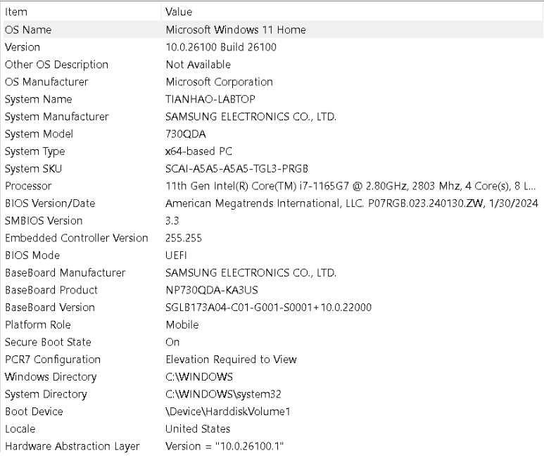

# Large Scale Data Processing: Final Project
For the final project, you are provided 6 CSV files, each containing an undirected graph, which can be found [here](https://drive.google.com/file/d/1khb-PXodUl82htpyWLMGGNrx-IzC55w8/view?usp=sharing). The files are as follows:  

| File name                   | Number of edges | Matching size (Bipartite-Algo)       | Matching size (Alon-Itai)         |
|------------------------------|-----------------|--------------------------------------|-----------------------------------|
| com-orkut.ungraph.csv        | 117,185,083      |                                      | 1,376,710 (927 seconds)           |
| twitter_original_edges.csv   | 63,555,749       | 92,018 (426 seconds)                              |                                   |
| soc-LiveJournal1.csv         | 42,851,237       | 1,546,942  (411 seconds)                          |   1,657,749 (554 seconds)                                |
| soc-pokec-relationships.csv  | 22,301,964       | 589,590 (233 seconds)                             |                                   |
| musae_ENGB_edges.csv         | 35,324           | 2,253 (5 seconds)                    | 2,392 (11 seconds)                |
| log_normal_100.csv           | 2,671            | 48 (5 seconds)                       | 49 (10 seconds)                   |


- **Largest file**: Processed on Google Cloud Platform using a `2x4 N2` machine for both the master and worker nodes.
- **Smallest two files**: Ran locally on the developer's machine.
- **Other files**: Processed on GCP with `2x4 N1` machines for both the master and worker nodes.


The specifications of the local machine used for testing can be found in the image below:




Algorithm 1: Bipartite Greedy matching (smaller vertices come first in priority)

Algorithm 2: Alon-Babai-Itai MIS Algorithm (Paper here: https://web.math.princeton.edu/~nalon/PDFS/Publications2/A%20fast%20and%20simple%20randomized%20parallel%20algorithm%20for%20the%20maximal%20independent%20set%20problem.pdf)

### Writeup/Report

We used two approaches for obtaining the matchings: **bipartite greedy matching** and the **Alon-Babai-Itai MIS algorithm**.

The bipartite matching algorithm focuses on finding a matching in a bipartite graph using a greedy approach. It begins by collecting all edges and vertices, then sorting the edges based on the weight of the source vertices. It iterates through the sorted edges and adds an edge to the matching set only if neither of its endpoints (source or destination vertices) are already matched. This ensures that each vertex is used at most once in the matching. The algorithm is efficient and straightforward, making it suitable for scenarios where finding a quick approximate matching is desirable.

The Alon-Itai algorithm iteratively computes a Maximal Independent Set (MIS) for a graph. In each iteration, it selects an independent set of vertices (a set of vertices where no two are adjacent), adds it to the MIS, and removes these vertices along with their neighbors from the graph. The process repeats until the graph is empty. A key optimization within the algorithm is the `inPhaseOptimized` function, which marks vertices probabilistically based on their degree and resolves conflicts to ensure a valid independent set. This algorithm is effective for problems requiring independent sets and is particularly useful for distributed or parallel computing needs.

If we were given a new test, we would probably run Alon-Itai, even if bipartite is slightly faster for smaller cases. While both algorithms are parallelizable and would work perfectly fine for most test cases, space begins to become a problem for bipartite when the input size gets extremely large. This is due to Scala’s lack of effective garbage collection, which can result in bipartite functions like `collect` and heap operations leading to heap space exhaustion—a problem we actually encountered.

To address this issue, we implemented Alon-Itai, which does not suffer from the same memory limitations. Both algorithms are very scalable in terms of time, as we make use of the Graph data structure and RDDs. Bipartite is faster, but AIB is more powerful, scalable, and accurate. AIB can work on any graph, even if it is cyclical or irregular, making it more versatile. It also uses randomization and local degree information, whereas bipartite does not. This allows AIB to find larger matchings and makes it more robust to variations in graph structure.

The only advantage of bipartite is its speed on smaller graphs. However, it fails to complete execution on very large graphs due to memory constraints. For massive graphs, we experienced Spark failures due to memory exhaustion and unbalanced partitions. AIB, on the other hand, streams most of the computation through graph operations and message passing, which results in a more stable memory profile across iterations—even though it takes slightly longer to run. As for the number of iterations, bipartite completes in one pass, while AIB takes `log(E)` iterations, where `E` is the number of edges.

Our implementation for the AIB algorithm does have some novel and original ideas. In the AIB paper, the authors originally intended for it to be used for finding an MIS. We were able to tweak it to find a matching, something which has never been done before.

The bipartite greedy matching algorithm has a proven **1/2-approximation guarantee**. This means the size of the matching it produces is always at least half that of the optimal matching. You can find a proof of this guarantee [here](https://bowaggoner.com/courses/gradalg/notes/lect06-approx.pdf?utm_source=chatgpt.com).As for the Alon-Babai-Itai (AIB) algorithm, the original authors did not provide a formal approximation guarantee. However, based on our testing, it consistently outperforms the bipartite greedy approach in both size and quality of matchings. This suggests that its approximation ratio is likely better than 1/2 in practice, even if not yet theoretically proven.

Our presentation slides can be found in this repo. Also, the matchings we submit are the largest ones we've got, typically form the AIB algirhtmm. They can be found in this repo named matching_solutions.zip. If you cannot access them, they will be in this google drive link:

https://drive.google.com/drive/folders/1k_0Heynrc9ibgxOoIczbpG2sp4zC_MDE?usp=sharing

### Matching Instructions

To run either algorithms do:
```
// Unix (Bipartite)
spark-submit --master "local[*]" --class "final_project.main" target/scala-2.12/project_3_2.12-1.0.jar compute data/log_normal_100.csv output_dir lubyalgo

// Unix (Alon-Itai)
spark-submit --master "local[*]" --class "final_project.main" target/scala-2.12/project_3_2.12-1.0.jar compute data/log_normal_100.csv output_dir alonitai

// Unix
spark-submit --master "local[*]" --class "final_project.matching_verifier" target/scala-2.12/project_3_2.12-1.0.jar data/log_normal_100.csv output_dir/part-00000
```

## Matching

Your goal is to compute a matching as large as possible for each graph. 

### Input format
Each input file consists of multiple lines, where each line contains 2 numbers that denote an undirected edge. For example, the input below is a graph with 3 edges.  
1,2  
3,2  
3,4  

### Output format
Your output should be a CSV file listing all of the matched edges, 1 on each line. For example, the ouput below is a 2-edge matching of the above input graph. Note that `3,4` and `4,3` are the same since the graph is undirected.  
1,2  
4,3  

## Correlation Clustering

Your goal is to compute a clustering that has disagreements as small as possible for each graph. 

### Input format
Each input file consists of multiple lines, where each line contains 2 numbers that denote an undirected edge. For example, the input below is a graph with 3 (positive) edges.  
1,2  
3,2  
3,4  

The 3 remaining pairs of vertices that do not appear in the above list denote negative edges. They are (2,4), (1,4), (1,3).

### Output format
Your output should be a CSV file describing all of the clusters. The number of lines should be equal to the number of vertices. Each line consists two numbers, the vertex ID and the cluster ID.

For example, the output below denotes vertex 1, vertex 3, and vertex 4 are in one cluster and vertex 2 forms a singleton cluster.  The clustering has a 4 disagreements.  
1,100  
2,200  
4,100  
3,100  


## No template is provided
For the final project, you will need to write everything from scratch. Feel free to consult previous projects for ideas on structuring your code. That being said, you are provided a verifier that can confirm whether or not your output is a matching or a clustering. As usual, you'll need to compile it with
```
sbt clean package
```  
### Matching

The matching verifier accepts 2 file paths as arguments, the first being the path to the file containing the initial graph and the second being the path to the file containing the matching. It can be ran locally with the following command (keep in mind that your file paths may be different):
```
// Linux
spark-submit --master local[*] --class final_project.matching_verifier target/scala-2.12/project_3_2.12-1.0.jar /data/log_normal_100.csv data/log_normal_100_matching.csv

// Unix
spark-submit --master "local[*]" --class "final_project.matching_verifier" target/scala-2.12/project_3_2.12-1.0.jar data/log_normal_100.csv data/log_normal_100_matching.csv
```

### Correlation Clustering

The clustering verifier accepts 2 file paths as arguments, the first being the path to the file containing the initial graph and the second being the path to the file describing the clustering. It can be ran locally with the following command (keep in mind that your file paths may be different):
```
// Linux
spark-submit --master local[*] --class final_project.clustering_verifier target/scala-2.12/project_3_2.12-1.0.jar /data/log_normal_100.csv data/log_normal_100_clustering.csv

// Unix
spark-submit --master "local[*]" --class "final_project.clustering_verifier" target/scala-2.12/project_3_2.12-1.0.jar data/log_normal_100.csv data/log_normal_100_clustering.csv

```

## Deliverables
* The output file for each test case.
  * For naming conventions, if the input file is `XXX.csv`, please name the output file `XXX_solution.csv`.
  * You'll need to compress the output files into a single ZIP or TAR file before pushing to GitHub. If they're still too large, you can upload the files to Google Drive and include the sharing link in your report.
* The code you've applied to produce the solutions.
  * You should add your source code to the same directory as the verifiers and push it to your repository.
* A project report that includes the following:
  * A table containing the objective of the solution (i.e. the size of matching or the number of disagreements of clustering) you obtained for each test case. The objectives must correspond to the matchings or the clusterings in your output files.
  * An estimate of the amount of computation used for each test case. For example, "the program runs for 15 minutes on a 2x4 N1 core CPU in GCP." If you happen to be executing mulitple algorithms on a test case, report the total running time.
  * Description(s) of your approach(es) for obtaining the matching or the clustering. It is possible to use different approaches for different cases. Please describe each of them as well as your general strategy if you were to receive a new test case. It is important that your approach can scale to larger cases if there are more machines.
  * Discussion about the advantages of your algorithm(s). For example, does it guarantee a constraint on the number of shuffling rounds (say `O(log log n)` rounds)? Does it give you an approximation guarantee on the quality of the solution? If your algorithm has such a guarantee, please provide proofs or scholarly references as to why they hold in your report.
* A 10-minute presentation during class time on 4/29 (Tue) and 5/1 (Thu).
  * Note that the presentation date is before the final project submission deadline. This means that you could still be working on the project when you present. You may present the approaches you're currently trying. You can also present a preliminary result, like the matchings or the clusterings you have at the moment.

## Grading policy
* Quality of solutions (40%)
  * For each test case, you'll receive at least 70% of full credit if your matching size is at 70% the best answer in the class or if your clustering size is at most 130% of the best in the class.
  * **You will receive a 0 for any case where the verifier does not confirm that your output is a correct.** Please do not upload any output files that do not pass the verifier.
* Project report (35%)
  * Your report grade will be evaluated using the following criteria:
    * Discussion of the merits of your algorithms such as the theoretical merits (i.e. if you can show your algorithm has certain guarantee).
    * The scalability of your approach
    * Depth of technicality
    * Novelty
    * Completeness
    * Readability
* Presentation (15%)
* Formatting (10%)
  * If the format of your submission does not adhere to the instructions (e.g. output file naming conventions), points will be deducted in this category.

## Submission via GitHub
Delete your project's current **README.md** file (the one you're reading right now) and include your report as a new **README.md** file in the project root directory. Have no fear—the README with the project description is always available for reading in the template repository you created your repository from. For more information on READMEs, feel free to visit [this page](https://docs.github.com/en/github/creating-cloning-and-archiving-repositories/about-readmes) in the GitHub Docs. You'll be writing in [GitHub Flavored Markdown](https://guides.github.com/features/mastering-markdown). Be sure that your repository is up to date and you have pushed all of your project's code. When you're ready to submit, simply provide the link to your repository in the Canvas assignment's submission.

## You must do the following to receive full credit:
1. Create your report in the ``README.md`` and push it to your repo.
2. In the report, you must include your teammates' full name in addition to any collaborators.
3. Submit a link to your repo in the Canvas assignment.

## Deadline and early submission bonus
1. The deadline of the final project is on 5/4 (Sunday) 11:59PM.  
2. **If you submit by 5/2 (Friday) 11:59PM, you will get 5% boost on the final project grade.**  
3. The submission time is calculated from the last commit in the Git log.  
4. **No extension beyond 5/4 11:59PM will be granted, even if you have unused late days.**  
